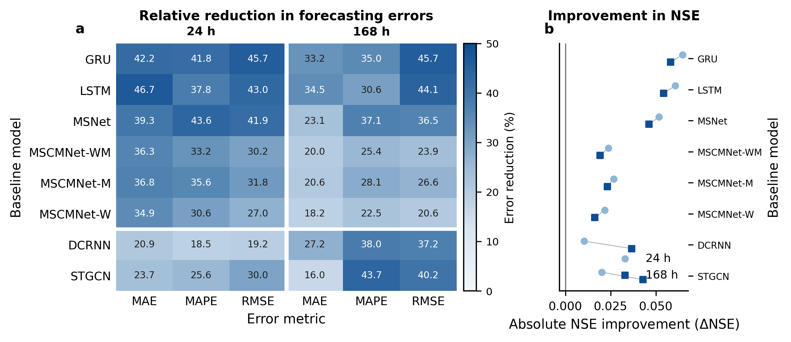
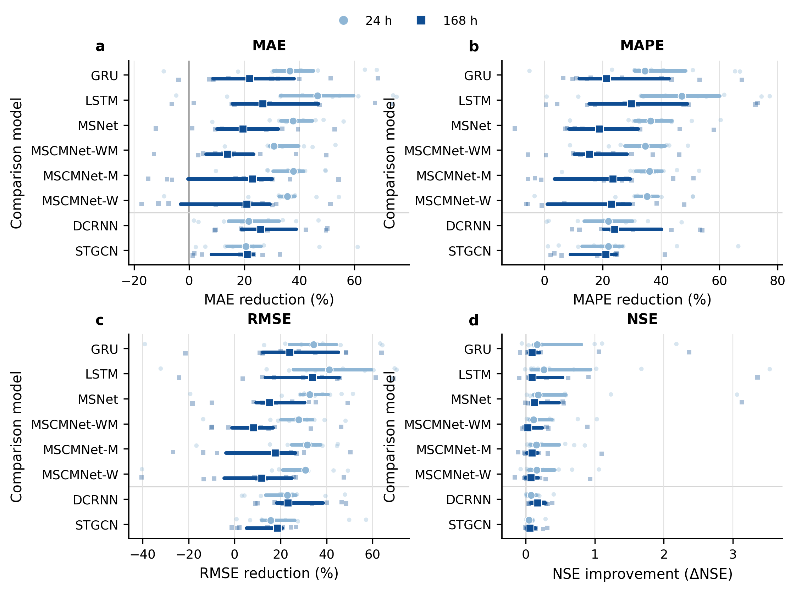
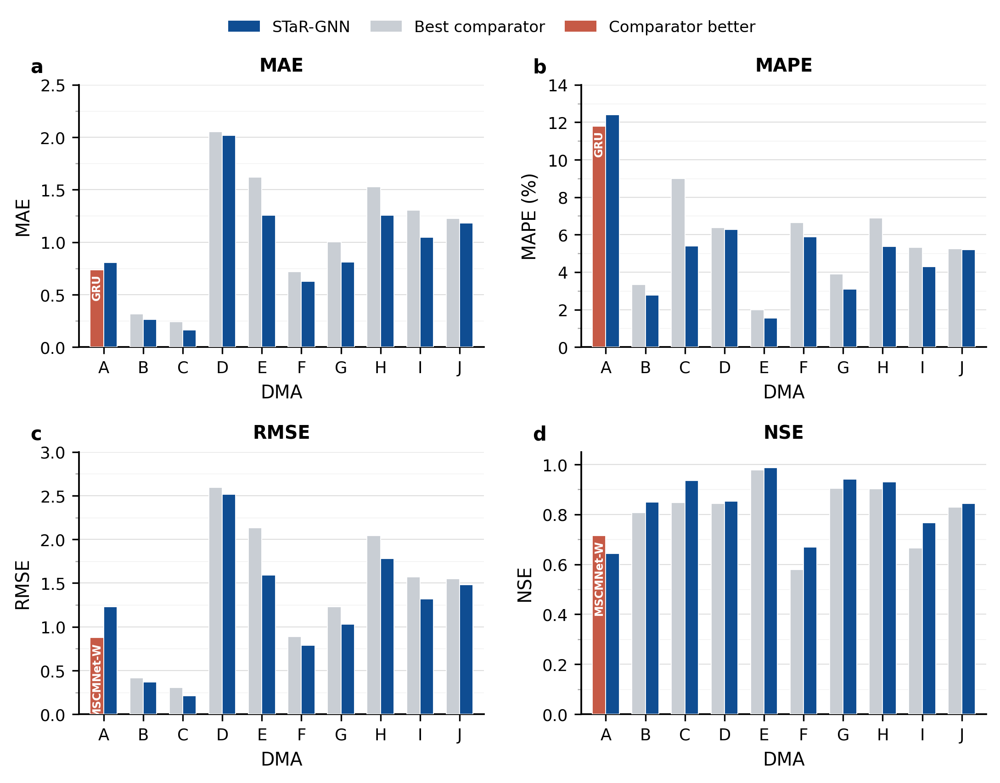
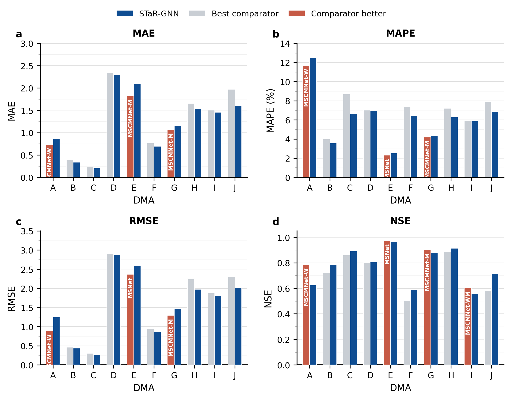
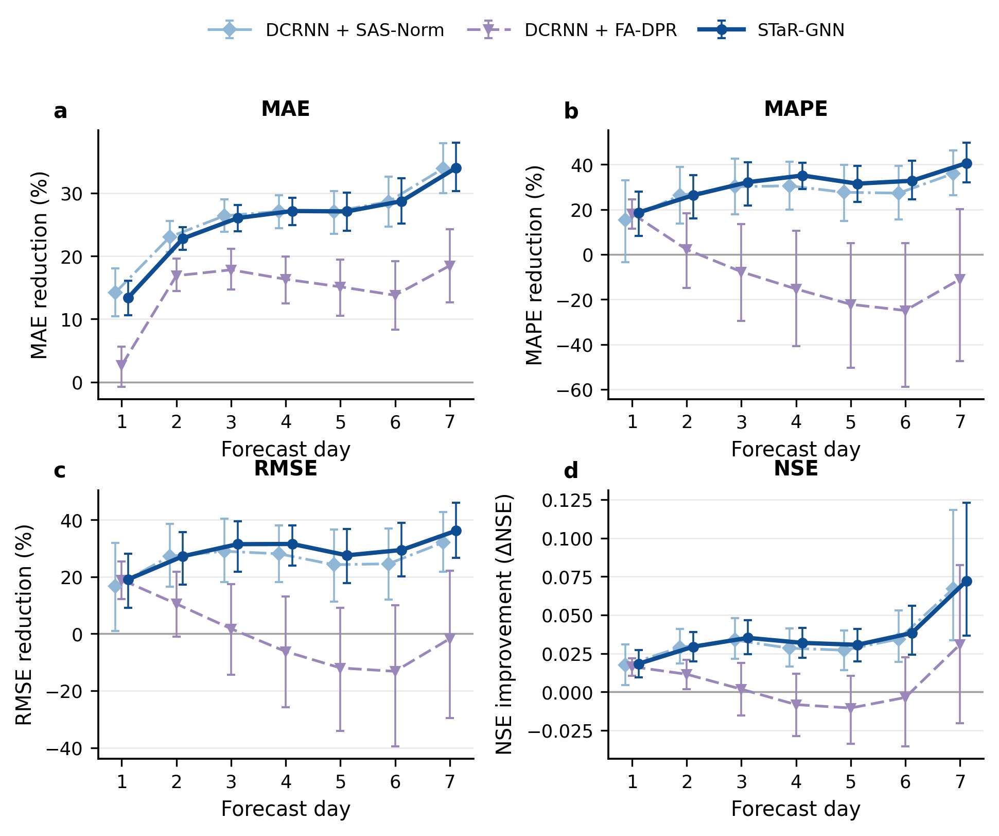
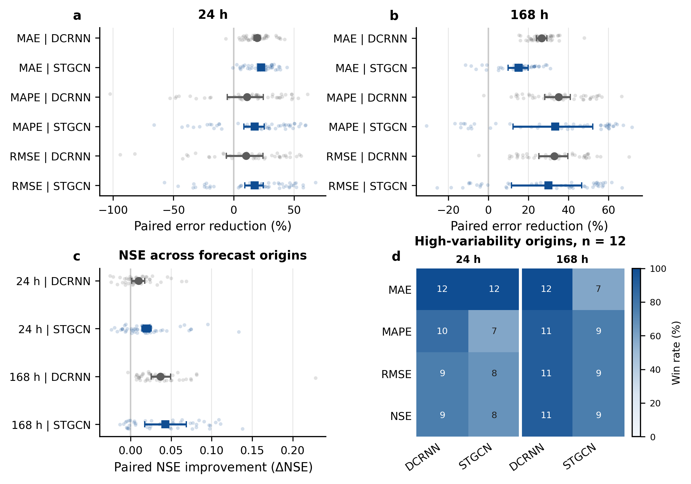
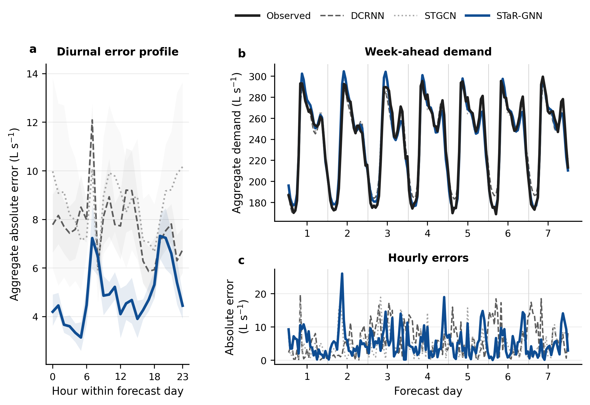

# 3. 结果与讨论

## 3.1 不同预测时域下的总体性能及空间一致性

为评价 STaR-GNN 的性能增益是否超越单一建模范式，本文构建了由时序预测到时空图预测的递进式比较。GRU、LSTM、MSNet、MSCMNet-WM、MSCMNet-M 和 MSCMNet-W 主要刻画需求序列的时间依赖与多尺度变化，DCRNN 和 STGCN 则进一步引入 DMA 之间的关联结构。六种时序模型用于确定 STaR-GNN 在现有预测方法中的总体位置，图模型则提供与其空间建模方式更接近的参照。

[Table 1](tables/submission/table1_overall_performance.md) 给出了两个预测时域下各模型的绝对性能。STaR-GNN 在 24 h 和 168 h 任务的 MAE、MAPE、RMSE 和 NSE 上均取得最优结果，说明其优势并未局限于特定指标或预测尺度。时序模型中，MSCMNet-W 的综合性能最具竞争力。对于 24 h 预测，STaR-GNN 的 MAE 约为该模型的三分之二，MAPE 由 2.600% 降至 1.805%。当预测时域延长至 168 h 后，相较于图模型中整体表现更优的 DCRNN，STaR-GNN 的 MAPE 和 RMSE 均降至原有水平的约六成，NSE 由 0.940 提高至 0.976。模型因而不仅提高了日前预测精度，对周尺度误差累积也表现出更强的抑制能力。

Fig. 1 进一步比较了 STaR-GNN 相对于各对比模型的改善幅度。热图中所有单元均为正值，三项误差指标的降幅均超过 16%，最大降幅接近 47%，表明性能增益广泛存在于两类对比模型和两个预测时域。24 h 任务中，相较于 LSTM 的 MAE 改善最为显著。168 h 任务中，相较于 STGCN 的 MAPE 降低约 44%，NSE 提高 0.043。尤其值得注意的是，预测时域延长后，相对于 DCRNN 和 STGCN 的 MAPE 与 RMSE 改善并未缩小，说明 STaR-GNN 的优势不只是短时序列拟合的结果，而更可能与其对跨日需求状态和位置相关周期模式的表征有关。

**Fig. 1. 不同预测时域下 STaR-GNN 相对各对比模型的总体性能改善。** 图中分别给出 MAE、MAPE 和 RMSE 的相对降幅以及 NSE 的绝对提升，正值表示 STaR-GNN 优于相应对比模型。

系统尺度的汇总结果并不能反映性能增益在各 DMA 之间的分布，因此 Fig. 2 进一步从分区尺度检验其空间一致性。24 h 任务中，各对比模型对应分布的中位数均位于零线右侧，且多数 DMA 取得正向改善，说明总体优势广泛覆盖不同分区。预测时域延长至 168 h 后，分布中心仍处于有利方向，但散点和四分位距整体扩展，部分时序对比模型出现更多接近或越过零线的结果；DCRNN 和 STGCN 的分布则仍较集中地位于零线右侧。预测时域延长因而没有改变总体优势的方向，却增强了 DMA 间的性能分化，使周尺度下的局部竞争边界值得进一步考察。

**Fig. 2. STaR-GNN 相对各对比模型的跨 DMA 改善分布。** 小点表示单个 DMA，较大标记和水平线段分别表示十个 DMA 的中位数与四分位距。圆形和方形分别对应 24 h 与 168 h 预测，零线右侧表示 STaR-GNN 优于相应对比模型。误差指标采用相对降幅，NSE 采用绝对差值；水平分隔线区分时序对比模型与图对比模型。

Fig. 2 所示的广泛改善并不意味着 STaR-GNN 在每个 DMA 上均达到最优，因为最具竞争力的替代模型会随分区、指标和预测时域而变化。为直接刻画这一局部竞争边界，Fig. 3 以绝对指标比较 24 h 任务中 STaR-GNN 与各 DMA 的最优对比模型。除 DMA A 外，STaR-GNN 在 DMA B 至 DMA J 上均取得更低的 MAE、MAPE 和 RMSE 以及更高的 NSE。DMA C 和 DMA E 的成对柱高差异较为明显，而 DMA D 和 DMA J 的两根柱更为接近，表明日前预测优势虽覆盖多数分区，其幅度并不均衡。DMA A 的橙色柱则直接标示了该分区的局部失利。

**Fig. 3. STaR-GNN 与最优对比模型在不同 DMA 上的 24 h 预测性能。** 子图分别表示 (a) MAE、(b) MAPE、(c) RMSE 和 (d) NSE。每个 DMA 中，蓝色柱表示 STaR-GNN，灰色柱表示八种对比模型中的最优结果；当对比模型优于 STaR-GNN 时，该柱以橙色标示，并在柱内注明模型名称。纵轴均从零开始，细网格用于辅助辨认相近数值。MAE、MAPE 和 RMSE 越低越好，NSE 越高越好。

当预测时域延长至 168 h 后，Fig. 4 中的橙色柱由一个 DMA 扩展至 DMA A、E 和 G，并出现在 DMA I 的 NSE 上，显示局部竞争关系随预测时域延长而分化。尽管如此，STaR-GNN 在 DMA B、C、D、F、H 和 J 上仍保持四项指标最优，并在 DMA I 的三项误差指标上领先。DMA D 的成对柱高仍较为接近，而 DMA J 的差异更为明显，说明长时域并未引起各分区性能的同步变化，而是改变了不同 DMA 从模型结构中获得的相对收益。这一空间异质性进一步引出对模型组件及其长提前期贡献的分析。

**Fig. 4. STaR-GNN 与最优对比模型在不同 DMA 上的 168 h 预测性能。** 子图分别表示 (a) MAE、(b) MAPE、(c) RMSE 和 (d) NSE。每个 DMA 中，蓝色柱表示 STaR-GNN，灰色柱表示八种对比模型中的最优结果；当对比模型优于 STaR-GNN 时，该柱以橙色标示，并在柱内注明模型名称。纵轴均从零开始，细网格用于辅助辨认相近数值。MAE、MAPE 和 RMSE 越低越好，NSE 越高越好。

## 3.2 模型组件的贡献及其提前期依赖性

[Table 2](tables/submission/table2_factorial_ablation.md) 同时给出了各消融变体的绝对性能及其相对于 DCRNN 的改善，从而在四项指标上区分 SAS-Norm 与 FA-DPR 的作用。24 h 任务中，两个组件单独使用时均改善了全部指标。SAS-Norm 对 MAE 的降低更明显，FA-DPR 对 MAPE 和 RMSE 的贡献相对更强，完整模型则在四项指标上取得最大总体增益。这表明两个组件分别作用于不同误差特征，其组合效果并非来自对单一指标的定向优化。

在 168 h 任务中，SAS-Norm 对三项误差均产生明确改善，误差降幅超过 27%，NSE 同时提高 0.034。FA-DPR 单独使用时主要改善 MAE 和 RMSE，MAPE 反而略有增加，说明历史日检索本身不足以稳定控制周尺度误差。完整模型保持了 SAS-Norm 的 MAE 水平，并进一步获得更优的 MAPE、RMSE 和 NSE。因而，SAS-Norm 构成周尺度性能的主要基础，FA-DPR 的价值更多体现在与日状态建模协同时对局部周期误差的补充修正。

上述汇总结果尚不能说明组件增益在一周内部如何形成。Fig. 5 进一步表明，SAS-Norm 与完整模型的曲线在四项指标上保持接近，并随预测日推进总体扩大，说明日状态分离与恢复主要抑制了跨日误差累积。相比之下，FA-DPR 的 MAE 改善始终为正，但 MAPE、RMSE 和 NSE 在一周中后段波动明显，多个置信区间跨越零线。这种差异说明，FA-DPR 的贡献依赖预测位置和评价指标，而 SAS-Norm 提供了更稳定的长提前期基础。该结果与模型设计动机相符，但仍不足以将历史日检索解释为性能提升的独立因果来源。

**Fig. 5. SAS-Norm 与 FA-DPR 在 168 h 预测中的逐日贡献。** 各变体均在相同测试起点和预测日上与 DCRNN 比较。点表示 46 个共同预测起点的平均改善，误差线表示采用七起点移动块自助法估计的 95% 置信区间，正值表示相应变体优于 DCRNN。

## 3.3 不同预测起点与周尺度需求动态下的稳健性

前述结果分别从系统平均、空间分区和模型组件说明了 STaR-GNN 的优势，下一步需要判断这种优势是否稳定存在于不同预测窗口，并识别误差在周尺度需求过程中出现的位置。这里的比较重点由广泛的模型定位转向结构受控的诊断。STaR-GNN 的创新建立在时空图预测框架之上，DCRNN 和 STGCN 分别代表循环式与卷积式图建模，因此以二者作为参照能够判断性能增益是否超越单纯引入图结构，并进一步检验跨日状态和位置相关模式建模的附加价值。时序对比模型已经在 Table 1 和 Figs. 1–4 中完成跨范式定位，不再在后续过程诊断中重复展开。

Fig. 6 从 46 个共同预测起点考察配对改善。24 h 任务中，相对于 DCRNN 和 STGCN 的 MAE 散点几乎全部位于零线右侧，平均降幅分别为 19.3% 和 22.6%，置信区间也与零线保持明显距离。MAPE、RMSE 和 NSE 的分布更宽，说明日前任务中的 MAE 优势最为稳定，而其他指标仍会受到局部峰值和总量偏差的影响。预测时域延长至 168 h 后，相对于 DCRNN 的四项分布整体右移，仅有极少数点落在不利方向。相对于 STGCN 的平均效应同样保持为正，但散点和置信区间更宽，表明两个图模型之间仍存在随预测窗口变化的竞争关系。

高波动起点进一步揭示了这一差异。Fig. 6d 中，相对于 DCRNN 的单元保持较深颜色，说明 STaR-GNN 在需求快速变化时仍能维持较广的优势。相对于 STGCN 时，周尺度 MAE 的颜色明显变浅，其余指标的优势覆盖也有所收窄。由此可见，STaR-GNN 的改进并非由少数易预测窗口形成，但突发需求变化仍会削弱其相对于较强图对比模型的领先程度。这一结果把总体稳健性限定为多数预测窗口中的稳定改善，而不是所有困难情形下的无条件获胜。

**Fig. 6. STaR-GNN 在不同预测起点和高波动需求窗口中的稳健性。** 图中给出 24 h 与 168 h 任务下逐起点的误差改善、NSE 提升及其块自助置信区间，并汇总高波动窗口中的领先次数。高波动窗口由观测需求的归一化平均绝对变化幅度确定。

逐起点分布回答了优势是否持续存在，Fig. 7 则进一步解释误差发生在周尺度过程的哪些位置。汇总全部共同起点后，STaR-GNN 的日内误差曲线在几乎所有小时都低于 DCRNN 和 STGCN。其系统总需水平均绝对误差为 4.920 L s\(^{-1}\)，而 DCRNN 和 STGCN 分别为 7.735 L s\(^{-1}\) 和 8.574 L s\(^{-1}\)，说明总体改善并非集中在少数低需水小时。

代表性预测周依据 STaR-GNN 误差最接近全部起点中位数的规则预先确定。Fig. 7b 表明，三个模型均能重现基本日周期，但 STaR-GNN 对跨日需求水平转换和多数局部峰谷的跟踪更接近观测。逐小时误差进一步显示，剩余较大偏差主要出现在需求快速上升或下降的时段。这与高波动窗口中相对于 STGCN 的优势收窄相呼应，也与 Fig. 5 所示 SAS-Norm 的长提前期贡献一致。综合这些证据可以推断，STaR-GNN 的周尺度优势主要来自对跨日状态变化的显式处理，而不是单纯提高对平稳日周期的拟合能力。完整统计见补充材料中的 [Table S3](tables/submission/tableS3_forecast_origin_robustness.md) 和 [Table S4](tables/submission/tableS4_week_ahead_dynamics.md)。

**Fig. 7. 群体日内误差与代表性 168 h 需水预测。** 图中依次展示全部共同测试起点聚合后的日内系统总需水绝对误差、按中位误差接近原则选取的代表性周预测轨迹，以及同一窗口的逐小时绝对误差。阴影表示采用七起点移动块自助法估计的 95% 置信区间，需求与误差单位均为 L s\(^{-1}\)。

## 3.4 结果解释、运行启示与研究边界

本文结果表明，多 DMA 需水预测中的长时域困难不仅来自误差随提前期累积，也来自不同分区和预测窗口对跨日状态变化的响应差异。Que et al. (2024) 与 Lin et al. (2025) 的多时间尺度需水研究同样发现，模型的相对性能会随预测尺度改变，周尺度预测不能被视为日前任务的简单延伸。Xue and Zhu (2025) 对图水文预测的研究进一步说明，系统平均指标可能掩盖节点尺度的局部差异。本文在此基础上表明，图结构能够提供跨 DMA 关联，但仅依赖固定空间传播仍不足以稳定处理跨日需求状态。SAS-Norm 对逐日改善轨迹的主导作用，以及 Fig. 7 中对跨日水平转换的更好跟踪，共同支持在图时空预测中显式区分日状态与日内变化形态。

从运行应用看，更准确的日前预测可为短期制水和泵组计划提供依据，周尺度预测则有望支持蓄水安排、检修计划和跨区域资源协调。STaR-GNN 在多数 DMA、预测起点和日内小时位置上的改善，显示了其服务多分区协同预测的潜力。然而，本文并未将预测结果接入调度或经济优化模型，因此不能直接推断其能够降低实际能耗或运行成本。DMA A、E 和 G 的局部失利，以及高波动条件下相对于 STGCN 的优势收窄，也说明实际应用仍需保留分区级误差监测和异常需求预警，不能仅依据系统总量评价模型。

这些结论仍受研究范围限制。实验仅基于一个真实多 DMA 供水系统，模型在其他城市、气候条件和用水结构下的可迁移性仍需外部数据验证。本文采用由历史需水相关性构建的静态功能图，该图不能等同于完整水力拓扑，也无法反映运行状态变化引起的动态关联。部分时序模型采用已有研究公开结果，因而跨来源比较主要用于性能定位，严格的配对统计只适用于本文统一协议下训练和评价的模型。此外，当前研究聚焦确定性点预测，尚未系统评估预测不确定性、传感器缺测和罕见异常事件的影响。这些限制不改变当前系统内的比较结论，但界定了模型推广和投入运行前仍需验证的范围。
