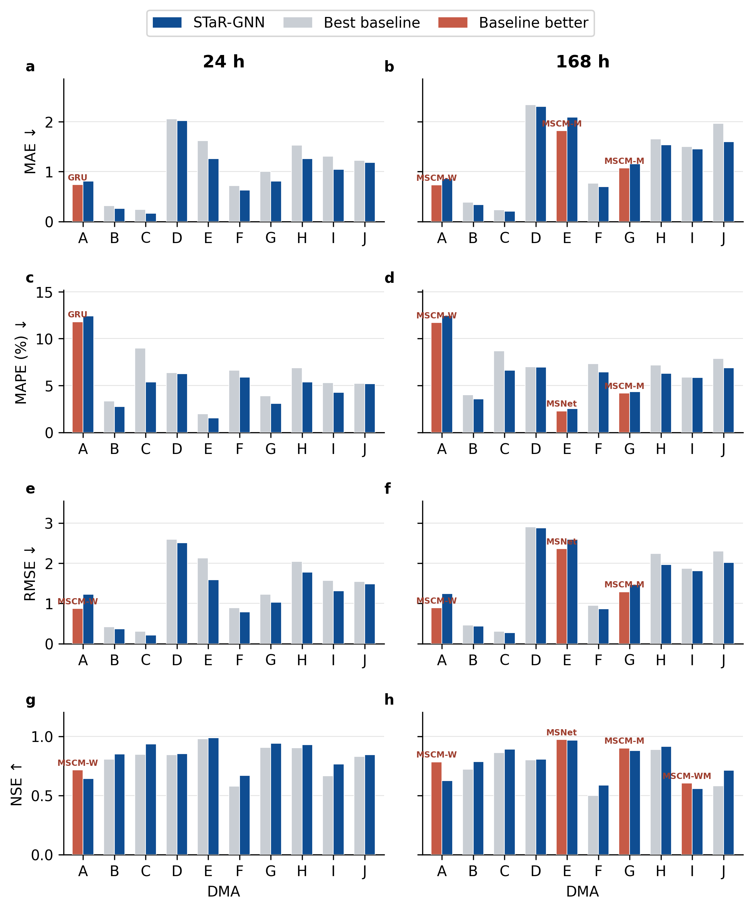

# 3. Results and discussion

## 3.1 Predictive performance across forecasting horizons and DMAs

Eight representative models were considered to determine whether the advantage of STaR-GNN extended across modeling paradigms. GRU, LSTM, MSNet, MSCMNet-WM, MSCMNet-M, and MSCMNet-W represent recurrent and multi-scale sequence models, whereas DCRNN and STGCN represent spatiotemporal graph models that explicitly describe inter-DMA dependence. The former group positions STaR-GNN against established water-demand sequence models; the latter tests whether its gains extend beyond generic graph modeling. Because the two groups originate from different evaluation sources, cross-source results are used for performance positioning only. Component attribution and paired inference are restricted to models evaluated using the same pipeline in this study.

[Table 1](tables/submission/table1_overall_performance.md) reports the overall metrics for the 24 and 168 h tasks. MAE is the sum of the ten DMA-level MAEs, whereas MAPE, RMSE, and NSE are evaluated on aggregate demand; the four metrics therefore provide complementary evidence but are not directly comparable in magnitude. STaR-GNN was the only model that achieved the lowest MAE, MAPE, and RMSE and the highest NSE at both horizons. Its MAE, MAPE, RMSE, and NSE were 9.424, 1.805%, 5.535, and 0.981 at 24 h and 12.234, 2.014%, 6.161, and 0.976 at 168 h, respectively. Neither MSCMNet-W, the closest sequence competitor overall, nor either graph baseline surpassed STaR-GNN on any overall metric. The latter comparison shows that the graph representations used by DCRNN and STGCN were not, by themselves, sufficient to attain the accuracy of STaR-GNN, motivating the component and lead-time analyses below.

Fig. 1 converts the absolute values in Table 1 into relative effect magnitudes. Against the six sequence models, STaR-GNN reduced MAE, MAPE, and RMSE by 34.9%–46.7%, 30.6%–43.6%, and 27.0%–45.7%, respectively, at 24 h, while increasing NSE by 0.022–0.065. The corresponding improvements at 168 h were 18.2%–34.5%, 22.5%–37.1%, 20.6%–45.7%, and 0.016–0.058. Relative to DCRNN and STGCN, the three errors decreased by 18.5%–30.0% at 24 h and 16.0%–43.7% at 168 h, with NSE gains of 0.010–0.020 and 0.037–0.043, respectively. The system-level advantage therefore extended across absolute error, relative error, sensitivity to larger deviations, and goodness of fit rather than being driven by one metric or horizon.

**Fig. 1. Overall performance improvements of STaR-GNN relative to the baseline models at different forecasting horizons.** (a) Relative reductions in MAE, MAPE, and RMSE; (b) absolute NSE improvement, where \(\Delta\mathrm{NSE}=\mathrm{NSE}_{\mathrm{STaR-GNN}}-\mathrm{NSE}_{\mathrm{baseline}}\). Positive values consistently favor STaR-GNN.

Overall metrics can conceal offsetting local improvements and degradations among DMAs. Figs. 2–3 therefore examine the spatial coverage of the preceding result. Across ten DMAs, eight baselines, and four metrics, Fig. 2 contains 320 descriptive DMA-level contrasts per horizon. These contrasts quantify coverage; they are not 320 independent replicates and are not used for significance testing. At 24 h, the median and interquartile range of all 32 baseline–metric distributions lay on the favorable side of zero, and 306/320 contrasts (95.6%) favored STaR-GNN; all 80 contrasts against the two graph baselines were positive. At 168 h, all medians remained positive, although seven interquartile ranges crossed zero and the favorable share decreased to 275/320 (85.9%); 78/80 graph-baseline contrasts remained positive. Thus, the overall gains were supported by most DMAs, while the longer horizon increased local performance heterogeneity.

**Fig. 2. Cross-DMA distributions of the improvements of STaR-GNN over each baseline model.** Panels show (a) MAE, (b) MAPE, (c) RMSE, and (d) NSE. Small points denote individual DMAs; large symbols and horizontal segments denote the median and interquartile range across the ten DMAs. Circles and squares identify 24 and 168 h, respectively. Error metrics are expressed as relative reductions and NSE as an absolute difference; positive values favor STaR-GNN. The horizontal divider separates six sequence baselines from two graph baselines.

The broad improvements in Fig. 2 do not imply that STaR-GNN is optimal for every DMA, because the strongest alternative can change with DMA, metric, and forecasting horizon. Fig. 3 therefore compares absolute metrics between STaR-GNN and the best baseline in each local setting. At 24 h, STaR-GNN achieved lower MAE, MAPE, and RMSE and higher NSE in DMAs B–J. The separation from the best baseline was pronounced in DMAs C and E, whereas the paired bars were close in DMAs D and J, revealing substantial variation in the magnitude of the local advantage. DMA A was the only location where STaR-GNN did not attain the best value for any of the four metrics.

At 168 h, STaR-GNN remained best on all four metrics in DMAs B, C, D, F, H, and J and retained the lowest three errors in DMA I, although its NSE was below the local best baseline. By contrast, the strongest baselines surpassed STaR-GNN on all four metrics in DMAs A, E, and G. The paired bars remained close in DMA D but separated more clearly in DMA J at the longer horizon. Extending the horizon therefore did not produce a uniform deterioration across the network; instead, it altered how individual DMAs benefited from the model structure. This spatial heterogeneity motivates the subsequent analysis of component contributions at longer lead times.

**Fig. 3. Absolute DMA-level performance of STaR-GNN and the best baseline.** Rows show MAE, MAPE, RMSE, and NSE, and columns show the 24 and 168 h tasks. Blue bars denote STaR-GNN, gray bars denote the best of the eight baselines for the same DMA, metric, and horizon, and orange bars indicate cases in which that baseline outperforms STaR-GNN. Lower MAE, MAPE, and RMSE and higher NSE indicate better performance.

## 3.2 Component contributions and lead-time dependence

Having established the overall and spatial extent of the gains, the next question is whether the two proposed components contributed independently and how their effects changed with lead time. The 2 × 2 factorial ablation in [Table 2](tables/submission/table2_factorial_ablation.md) shows that adding either SAS-Norm or FA-DPR to DCRNN improved 24 h forecasting. SAS-Norm reduced MAE, MAPE, and RMSE by 12.2%, 9.1%, and 10.4%, respectively, whereas the corresponding reductions from FA-DPR were 5.7%, 12.1%, and 11.2%. The full model increased these reductions to 20.9%, 18.5%, and 19.2% and achieved the highest NSE. The two components therefore made non-identical performance contributions at the day-ahead horizon.

Their roles were unequal at the weekly horizon. Relative to DCRNN, SAS-Norm reduced 168 h MAE, MAPE, and RMSE by 27.3%, 35.3%, and 34.1% and increased NSE from 0.940 to 0.974, accounting for most of the long-horizon accuracy gain. FA-DPR alone reduced MAE by 16.2% and RMSE by 4.9% and increased NSE by 0.006, but MAPE increased slightly from 3.248% to 3.278%, demonstrating metric-dependent rather than uniformly beneficial effects. The full STaR-GNN achieved the best 168 h MAPE, RMSE, and NSE. Its MAE of 12.234 differed by only 0.026 from SAS-Norm-only (12.208), and the moving-block 95% confidence interval for their paired per-origin MAE difference (−0.129 to 0.177) included zero. This point estimate should therefore not be interpreted as stable superiority of either configuration.

Fig. 4 extends the factorial comparison across the seven forecast days. The MAE reduction of STaR-GNN relative to DCRNN increased from 13.4% on Day 1 (95% CI: 10.6%–16.1%) to 34.0% on Day 7 (30.3%–38.0%). The SAS-Norm-only reduction similarly increased from 14.2% to 33.9%, consistent with its dominant contribution to weekly-scale accuracy. The MAE reduction from FA-DPR alone rose from 2.7% to 18.5%, although its MAPE and RMSE deteriorated on some intermediate and late forecast days and had wider intervals. The full-model advantage was consequently not a simple additive gain on every metric: SAS-Norm supplied the principal long-horizon contribution, whereas the effect of FA-DPR varied with metric and forecast position. This behavioral evidence is consistent with the design rationale, but it neither isolates the retrieved historical days as the cause of each improvement nor explains the physical drivers of demand.

**Fig. 4. Day-wise contributions of SAS-Norm and FA-DPR to 168 h forecasting.** Panels show (a) MAE, (b) MAPE, (c) RMSE, and (d) NSE. Each variant is compared with the same DCRNN using the same forecast origin and day, with effect direction standardized so that positive values favor the variant. Points are means over the 46 ordered forecast origins and error bars are 95% confidence intervals from a seven-origin moving-block bootstrap. Markers within a forecast day are offset slightly only to prevent overlap.

## 3.3 Robustness across forecast origins and demand conditions

System-level averages may still be dominated by a small number of easily predicted periods. Fig. 5 therefore includes only DCRNN, STGCN, and STaR-GNN, for which identical inputs, test windows, and raw predictions are available. GRU, LSTM, MSNet, and the MSCMNet variants are excluded because their supplementary material does not provide forecast-origin outputs; sample distributions cannot be reconstructed from DMA-average metrics. The 46 common origins are temporally ordered, and the 168 h windows overlap. Confidence intervals were therefore obtained using a seven-origin moving-block bootstrap rather than treating origins as independent replicates.

For the 24 h task, STaR-GNN achieved lower MAE than DCRNN and STGCN at 45/46 origins, with mean reductions of 19.3% (95% CI: 16.7%–21.6%) and 22.6% (20.6%–25.0%), respectively (Fig. 5a). Its MAPE, RMSE, and NSE intervals relative to STGCN were also entirely favorable. Relative to DCRNN, MAPE and RMSE improved at 35/46 and 32/46 origins, but their block confidence intervals for the mean reduction crossed zero. NSE improved at 32/46 origins, with a mean increase of 0.0099 (0.0017–0.0176). Hence, the day-ahead aggregate advantage in Table 1 did not imply equal stability for every origin or aggregate-demand metric.

The paired advantage became more consistent at 168 h (Figs. 5b–c). Relative to DCRNN, MAE improved at all 46 origins and MAPE, RMSE, and NSE at 45/46 origins; all four block confidence intervals lay in the favorable direction. Against STGCN, the corresponding win counts were 40, 36, 35, and 35. The mean MAE reduction was 15.1% (9.8%–19.8%), and the mean NSE increase was 0.0432 (0.0175–0.0686). The weekly-scale advantage was therefore observed across most common test origins rather than being produced by a few forecast weeks.

Difficult conditions were defined from observations rather than model errors. For each origin, the mean absolute hourly change was normalized by mean demand within each DMA, and the median across the ten DMAs defined the normalized mean absolute ramp. The 12 origins in the highest horizon-specific quartile were designated as high-variability windows. Within this stratum, STaR-GNN had lower MAE than DCRNN at 12/12 origins at both horizons, and the other three 168 h metrics improved at 11/12 origins. Relative to STGCN at 168 h, the MAE win count decreased to 7/12 and the remaining metrics to 9/12 (Fig. 5d). The defensible conclusion is thus that gains remained in the majority of high-variability windows but narrowed against STGCN, not that STaR-GNN won universally under difficult conditions.

**Fig. 5. Robustness of STaR-GNN across forecast origins and high-variability demand windows.** (a–b) Per-origin reductions in MAE, MAPE, and RMSE relative to DCRNN/STGCN at 24 and 168 h. Faint points are the 46 common forecast origins; filled symbols and error bars are the means and seven-origin moving-block bootstrap 95% confidence intervals. (c) Corresponding absolute NSE improvements. (d) Win counts in the highest quartile of observed normalized mean absolute ramp (n = 12 at each horizon); color denotes win rate and cells report the number of wins. Positive effects favor STaR-GNN.

## 3.4 Week-ahead demand dynamics and practical implications

The origin-level analysis establishes whether gains are stable but not where errors arise within a demand trajectory. Fig. 6 therefore progresses from the population diurnal structure to a representative weekly trajectory and its corresponding hourly errors. After aggregating the 46 common origins and seven forecast days, the mean aggregate-demand absolute error of STaR-GNN over the 24 intraday positions was 4.920 L s\(^{-1}\), compared with 7.735 and 8.574 L s\(^{-1}\) for DCRNN and STGCN. STaR-GNN had lower mean error at 22/24 and 23/24 intraday positions, respectively, indicating that the improvement covered most of the diurnal cycle rather than being confined to low-demand hours.

The representative week was not selected by visual appearance. A predefined rule selected the origin whose STaR-GNN total MAE was closest to the median over the 46 origins, yielding common index 70. Its MAE was 12.182 compared with an overall median of 12.193; DCRNN and STGCN achieved 15.517 and 14.653 for the same origin. All three models reproduced the dominant diurnal cycle (Fig. 6b), but STaR-GNN more closely followed demand-level transitions and several local peaks and troughs. Hourly errors nevertheless formed spikes during some rapidly changing periods (Fig. 6c). This remaining behavior is consistent with the reduced margin against STGCN in the high-variability windows in Fig. 5 and identifies abrupt demand changes as a continuing challenge.

**Fig. 6. Population diurnal errors and a representative 168 h demand forecast.** (a) Aggregate-demand absolute error by intraday position after pooling all common forecast origins and seven forecast days; shading denotes seven-origin moving-block bootstrap 95% confidence intervals. (b) Representative 168 h aggregate-demand trajectory selected by the median-error proximity rule. (c) Hourly absolute errors for the same origin. Demand and error are expressed in L s\(^{-1}\). The selection rule and origin index are fixed in the reproducibility artifacts.

The resulting evidence chain progresses from overall averages to DMAs, components, forecast days, test origins, and hourly behavior. As in multi-horizon water-demand studies (Que et al., 2024; Lin et al., 2025), the contrast between methods changed with forecast scale, so the weekly task could not be treated as a simple extension of day-ahead accuracy. Graph-based hydrological forecasting research likewise shows the value of examining local behavior and spatial structure in addition to aggregate metrics (Xue and Zhu, 2025). In the present experiments, DCRNN and STGCN did not attain the accuracy of STaR-GNN, while the factorial ablation associated most of the weekly-scale gain with SAS-Norm and a smaller, metric- and lead-time-dependent contribution with FA-DPR. Because this evidence describes model behavior rather than an interventional mechanism, it supports consistency with the design rationale but not a causal explanation of demand processes.

More stable day-ahead and week-ahead forecasts could inform short-term treatment and pump scheduling and longer-horizon storage, maintenance, and resource coordination, respectively. Improvements across most DMAs, origins, and intraday positions indicate potential for coordinated multi-DMA forecasting. However, downstream control and economic optimization were not evaluated, so demonstrated cost or energy savings cannot be claimed. The local exceptions in DMAs A, E, and G and the narrower margin against STGCN in high-variability windows also indicate that deployment should retain DMA-level error monitoring and abnormal-demand alerts rather than relying only on aggregate demand.

Four boundaries qualify the conclusions. First, the experiments concern one real multi-DMA system; transferability across cities, climates, and demand regimes requires external validation. Second, the graph represents functional dependence inferred from historical demand rather than complete hydraulic topology and does not change with operating conditions. Third, the six sequence and multi-scale model values originate from Que et al. (2024). They position performance across published alternatives, whereas strict paired inference applies only to DCRNN, STGCN, and STaR-GNN under the common protocol. Fourth, this study evaluates deterministic point forecasts and does not quantify predictive intervals or reliability under sensor missingness and rare abnormal events. These limitations do not alter the within-system comparison but define the evidence required before broader transfer or operational adoption.
